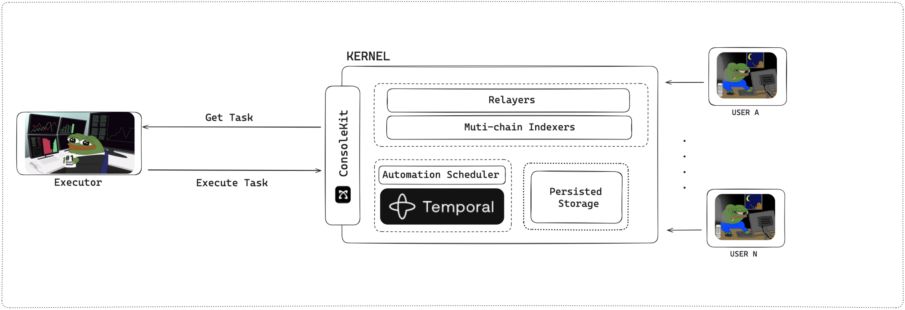

# Scaffold Agent

A collection of example implementations showcasing how to build autonomous DeFi agents using Console Kit. This repository demonstrates integration patterns ranging from LLM-powered execution to automated DeFi workflows.



## Purpose

This scaffold serves as a starting point for developers looking to build autonomous DeFi agents. Whether you're interested in LLM-powered automation or traditional programmatic workflows, these examples provide patterns for integrating Console Kit's capabilities into your applications.

## Overview

The repository contains two core components:

### OpenAI Agent

A LangChain-based implementation showing how to create LLM agents that can execute DeFi operations through Console Kit. The agent integrates Console Kit's native tools (cross-chain bridges, swap routing, token transfers etc.) into a LangChain executor, enabling natural language driven DeFi automation.

### Kernel Workflow

Example implementations of automated DeFi workflows using Console Kit's infrastructure. These examples demonstrate how to set up autonomous agents that can execute complex DeFi strategies while leveraging Console's policy engine and execution framework.

## Local setup

1. Install dependencies

```bash
cd openai-agent && yarn
```

```bash
cd kernel-workflow && yarn
```

2. Set up environment variables and fill all values

```bash
mv .env.example .env
```

## Running components

### OpenAI Agent

1. Run the local test agent:

```bash
make run-agent
```

from root dir

This will start an interactive session where you can chat with the agent. The agent can:

- Send tokens
- Bridge tokens between chains
- Check bridge status
- Swap tokens

Example commands:

```
> Send 100 USDC from 0x123... to 0x456... on chain 1
> Bridge 100 USDC from Ethereum to Polygon
> Check bridge status for transaction 0x789... with pid 1
> Swap 100 USDC for ETH on Ethereum
```

Type 'exit' to quit the interactive session.

### Kernel Workflow

1. To register your executor on console & kernel -

   - Configure `ExecutorConfigConsole`, `ExecutorMetadata`, and `ExecutorConfigKernel` on [register-executor.ts](./kernel-workflow/src/register-executor.ts) as per your requirements
   - Run from root dir:

   ```
   make run-register-executor
   ```

   - Pick up `registryId` from the script's response and update `EXECUTOR_REGISTRY_ID` in your .env, for running the remaining scripts

2. To deploy a console account that is subscribed to the automation of the executor just registered -
   - Configure `AutomationSubscriptionParams` on [deploy-automation-account.ts](kernel-workflow/src/deploy-automation-account.ts) as per your requirements
   - Run from root dir:
   ```
   make run-deploy-account
   ```
3. To run your automation workflow -
   - Modify `pollTasksAndSubmit()` on [agent-workflow.ts](kernel-workflow/src/agent-workflow.ts) with your automation logic. Console Kit SDK comes pre-built with native actions & helpers to make this easier
   - Run from root dir:
   ```
   make run-agent-workflow
   ```
   This will poll for your executable tasks, and run your automation periodically

## Additional Links

- [Console Kit Docs](https://github.com/Brahma-fi/console-kit/blob/ft-docs/docs/introduction.md)
- [Console Kit SDK](https://www.npmjs.com/package/brahma-console-kit)
- [Brahma Builder](https://github.com/Brahma-fi/brahma-builder)
- [Discord](https://discord.com/invite/khXHEnvS6N) (Join to get Console API credentials)
